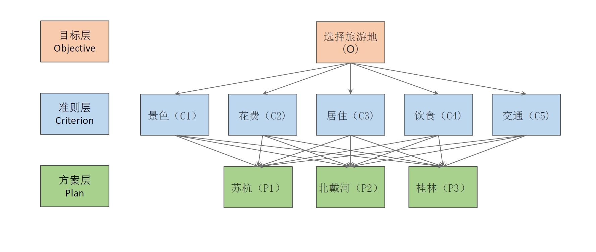

# AHP层次分析法

## 简介

层次分析法（Analytic Hierarchy Process, AHP）由美国运筹学家Thomas L. Saaty教授在20世纪70年代提出。层次分析法是的一种主观赋值评价方法，将与决策有关的元素分解成目标、准则、方案等多个层次，并在此基础上进行定性和定量分析，是一种系统、简便、灵活有效的决策方法。

简单来说，AHP常用于解决**评价类问题**，评价类问题例子：购买一个物品的时候会跟其他店的同款商品进行比较，最终确定一个商品。

AHP经常将一个决策（一个决定）分解为目标层，准侧层，方案层。例子如图所示：



该方法需要**专家经验**判断指标相对重要程度，再计算权重，比较适合解决难以用定量方法应对的问题。也适合难以获取大量指标实际数据样本的情况。

AHP法的分析一般有4个步骤：


层次分析法应用过程中，大体步骤主要包括四个。

第一步是层次结构模型的构建，即构建评价指标体系。

第二步构造判断矩阵，需要通过专家打分或集体讨论来构造判断矩阵。

第三步为层次单排序，这步即为对指标定权。

第四步为一致性检验，一致性检验确保专家的判断在逻辑上是一致的，避免了主观判断上的矛盾。如果一致性比率CR小于预设阈值（通常为0.1），则认为判断矩阵具有一致性，权重有效。

PS：一致性检验的含义用于确定构建的判断矩阵是否存在逻辑问题，例如以A、B、C构建判断矩阵，若判定A相当于B为3（A比B稍微重要），A相当于C为1/3（C比A稍微重要），在判断B相当于C时，根据上述的逻辑，理应C比B重要，若我们在构建判断矩阵时，错误填写为B相当于C为3（B比C稍微重要），那么就犯了逻辑错误。

## 2 **算法原理与步骤**

### 2.1 评价模型

评价模型就构建评价指标体系。由相应领域专家调研制定指标体系。

例如，影响选择旅游地有4大因素，如景色，门票，交通，拥挤度。

### 2.2 **判断矩阵**

构造判断矩阵就是通过各要素之间相互两两比较，并确定各准则层对目标层的权重。

简单地说，就是把准则层的指标进行两两判断，通常1-9标度方法或1-5标度方法。


1-9标度法

如果采用1-5分标度法，即比如A因素相对B因素非常重要，此时打5分，那么B因素相对于A因素就是1/5即0.2分。A因素相对B因素比较重要，此时打3分；A因素相对B因素重要程度一样，此时为1分。

**例子**

对应选择旅游景点的问题。

找到10位旅游专家，对旅游的4个影响因素（分别是景色，门票，交通和拥挤度）进行评价（即专家评价）

共有10个旅游专家打分，最终将10个旅游的打分进行**计算平均分，得到最终的判断矩阵表格。**（如10个专家对a21的打分都是3，则a21平均后也为3）

总体如下表：


上表格显示：门票相对于景色来讲，重要性更高，所以为3分；相反，景色相对于门票来讲，则为0.33333分。交通相对于景色来更重要为2分，其余类似下去。

如使用公式，判断矩阵元素公式为：

aij = 1，元素 i 与元素 j 对上一层次因素的重要性相同；

aij = 3，元素 i 比元素 j比较重要；

aij = 5，元素 i 比元素 j 非常重要；

反之则为


### 2.3 权重计算（层次单排序）

计算流程

特征向量

（1）首先对矩阵各列求和，然后归一化处理（$b_{ij}$）

选择旅游景点例子结果如下图所示：


归一化处理公式如下


式中， $\sum a_{ij}$为各列的和。例如b11=1/8=0.125。

（2）对新矩阵每一行进行求和，得出**特征向量**


2.权重值

计算权重值（*W*）对特征向量进行归一化处理，如下图：


例：0.483766/4=0.120942；1.667208/4=0.416802；以此类推。

### 3.4 一致性校验

一致性检验确保专家的判断在逻辑上是一致的，避免了主观判断上的矛盾。如果一致性比例`CR`小于预设阈值（通常为0.1），则认为判断矩阵具有一致性，权重有效。

**步骤**

(1) 计算一致性指标CI


其中计算最大特征根λ_{max}，采用“和积法”


式中，A*W*表示矩阵 A与 *W* 相乘，n为阶数。
**最大特征根计算例子**


（2）平均随机一致性指标RI值可对应表格进行查询得到。

这个RI表是[SPSSAU](https://www.zhihu.com/question/310066733/answer/2323332433)官方使用的。


（3）一致性比例CR值


当𝐶𝑅<0.1，认为矩阵的一致性是可以接受的。

**例子**

选择旅游景点


最大特征根计算代码

```bash
import numpy as np
A = [
    [1, 1./3, 1./2, 1./2],
    [3, 1, 2, 2],
    [2, 1./2, 1, 2],
    [2, 1/2, 1/2, 1]
]
W = [0.120942, 0.416802, 0.269481, 0.192776]
A = np.array(A)
W = np.array(W)
# 使用numpy的dot函数进行矩阵乘法
result_matrix = np.dot(A, W)
# 打印结果矩阵
print("矩阵A乘以矩阵B的结果为：")
print(result_matrix)
aw = 0
for i in range(4):
    aw += result_matrix[i] / W[i]
print(f"最大特征根={aw/ 4}")
```

## 3 Python 代码

例子

```python
A = [
    [1, 1./3, 1./2, 1./2],
    [3, 1, 2, 2],
    [2, 1./2, 1, 2],
    [2, 1/2, 1/2, 1]
]
A = np.array(A)
ahp1 = AHP(A)
w = ahp1.get_eig()
print(f"权重= {w}")
# 一致性
ahp1.test_consitst()

"""
最大的特征值: 4.071
对应的特征向量为: [0.2204 0.7647 0.4951 0.3486]
归一化后得到权重向量: [0.1205 0.4181 0.2707 0.1906]
权重= [0.1205 0.4181 0.2707 0.1906]
判断矩阵的CI值为0.0237
判断矩阵的RI值为0.89
判断矩阵的CR值为0.0266，通过一致性检验
"""
```

## 4 参考资料

[用人话讲明白AHP层次分析法（非常详细原理+简单工具实现）- 知乎](https://zhuanlan.zhihu.com/p/448412538)

多层例子：[AHP分析法（python代码实现）_ahp层次分析法python-CSDN博客](https://blog.csdn.net/xiaziqiqi/article/details/128839557)