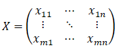

# 变异系数法

## 1、简介

**变异系数法**（Coefficient of variation method）是一种根据统计学方法计算系统各指标变化程度的客观赋权法。

变异系数法有很多种叫法，如离散系数法，信息量权重法。

**变异系数法**的基本思想是：

变异系数法是通过计算数据中包含的信息来确定各指标的权重。该方法认为，变化差异较大的指标应该被赋予较大的权重，而变化差异较小的指标则应该被赋予较小的权重。

然而，需要注意的是，变异系数法的前提假设是数据服从正态分布，因此在实际操作中应先检验数据的分布情况。

**变异系数（Coefficient of Variation）的公式为：标准差/平均值。**

## 2、**算法原理与步骤**

### 2.1、数据标准化处理

说明：对原始数据组进行标准化处理，消除各指标的量纲差异，把各指标数值压缩在[0-1]区间内。

假设现有一组数据，有m个待评价对象，n个评价指标，构成原始数据矩阵X：

 **Min-Max 标准化**

若所用指标的值越大越好（正向指标）：

$$
x' = \frac{x-x_{min}}{x_{max}-x_{min}}
$$

若所用指标的值越小越好（负向指标）：

$$
x' = \frac{x_{max}-x}{x_{max}-x_{min}}
$$

### 2.2、**计算变异系数**

**变异系数（Coefficient of Variation）的公式为：标准差/平均值。**

也叫指标间的波动性，主要以标准差的形式来表现：

$$
\left\{\begin{matrix}
\bar{x}_j = \frac{1}{m}\sum_{i=1}^mx_{ij}
 \\
S_j=\sqrt{\frac{\sum_{i=1}^m(x_{ij}-\bar{x}_j)^2}{m-1}}
\end{matrix}\right.
$$

上面第一个式子表示为求第j个指标的均值，第二个式子中Sj表示第j个指标的标准差。

各项指标的**变异系数公式**如下：

$$
V_j = \frac{S_j}{\bar{x}_j}
$$

### 2.3、计算权重（变异系数归一化）

权重为：

$$
W_j = \frac{V_j}{\sum_{j=1}^nV_j}
$$

### 2.4、**计算综合得分**

$$
Z_i=\sum_{j=1}^nW_j*x_{ij}
$$

## 3、参考资料

[变异系数法-python](https://mp.weixin.qq.com/s/R3i9DY7UXQFDPeR3DkYuVA)

[变异系数法的原理、计算步骤及stata操作 - 知乎 (zhihu.com)](https://zhuanlan.zhihu.com/p/675163089)

[Python综合评价模型（七）变异系数法 (qq.com)](https://mp.weixin.qq.com/s/SkwoyngiW4CPLpCSVVLkJQ)

