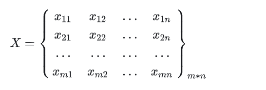

# 熵权法

## 1、简介

**熵权法（Entropy Weight Method， EWM）**又称熵值法，是最常用的客观赋权方法之一。

熵权法利用数据熵值信息即信息量大小进行权重计算，熵权法借鉴化学熵和信息熵的定义。

在数学中，信息熵表示事件所包含的信息量的期望。根据定义，对于某项指标，可以用熵值来判断某个指标的离散程度，其熵值越小，指标的离散程度越大，该指标对综合评价的影响（权重）越大。

熵本源于热力学，后由香农（C. E. Shannon）引入信息论，根据熵的定义与原理，当系统可能处于几种不同状态，每种状态出现的概率为$p_{i}$( i = 1 , 2 , . . . ,m ) ，则该系统的熵就可定义：

$$
e=-\frac{1}{ln(m)}\sum_{i=1}^{n}(p_{i}ln(p_{i}))  
$$

**优点：在处理多指标赋权的问题时，可以消除人为主观赋值带来的结果偏差，规避主观因素的影响，提高评价结果的客观性和一致性。**

**缺点：**

1. 过于依赖样本。随着样本变动权重会产生波动（如果样本分布不均或存在异常值，结论可能会失真）

2. 需结合业务经验。无法体现指标之间的关联性（如相关性、层级关系（一级指标和三级指标放一起评估就很奇怪）等），需要结合业务经验来选择指标。

## 2、**算法原理与步骤**

### 2.1、数据标准化处理

说明：对原始数据组进行标准化处理，消除各指标的量纲差异，把各指标数值压缩在[0-1]区间内。

1）**处理前**

明确指标属性，正向指标 or 负向指标；选择处理方法（通常用极差标准化的方法）。

2）**处理中**：

假定原始数据矩阵X 由m 个样本，n个指标构成，$X=(X_{ij})_{m*n}$

正向指标标准化：

负向指标标准化：

3）**处理后，得到新的数据矩阵，$X^1$**

### 2.2、**计算比重**

第i个评价对象关于所有对象第j个指标样本值的比重。

$$
p_{ij} = \frac{x_{ij}^{1}}{\sum_{i=1}^{m}x_{ij}^{1}}
$$

### 2.3 计算熵值

计算第j项指标的熵值。即将第j项指标的每个样本的比值通过公式计算相加。

$$
e_j=-\frac{1}{ln(m)}\sum_{i=1}^{m}p_{ij}*ln(p_{ij})
$$

其中：$k>0;e_j>=0$

### 2.4 计算变异系数

第j个指标的变异系数$d_j$为

$$
d_j=1-e_j
$$

j=1,2,..n

### 2.5 计算权重

第 j 个指标的权重为

$$
w_j=\frac{d_j}{\sum_{j=1}^{n}d_j}
$$

### 2.6 计算样本综合评分

第 i 个评价对象的中华评价值为

$$
Z_i=\sum_{j=1}^{n}w_j*x_{ij}^1
$$

推荐乘以标准化的结果，也可以乘以比重$p_{ij}$ ，它是$x_{ij}$进行标准化后又进行归一化。

但$p_{ij}$对于新样本的加入无法很好处理。

注意：标准化后的数据得到的评分乘以100后范围是【0-100】，但一般很少能达到80分以上，必要时可以做适当缩放。

## 3、参考资料

[一文读懂熵权法（熵值法） - 知乎 (zhihu.com)](https://zhuanlan.zhihu.com/p/677564565)

[Python综合评价模型（八）熵权法_python 熵权法-CSDN博客](https://blog.csdn.net/Yif18/article/details/130009774)

[【建模算法】熵权法（Python实现）_熵权法python代码-CSDN博客](https://blog.csdn.net/baidu/article/details/125104966)